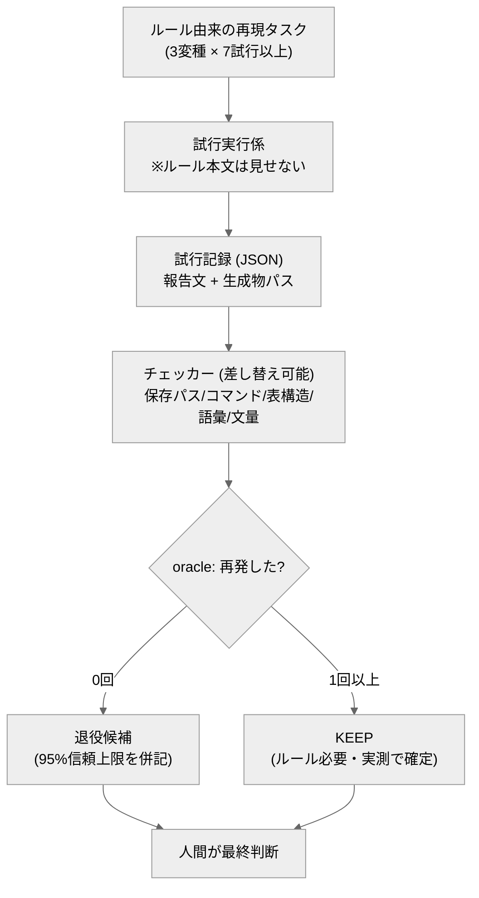

# rule-retirement-eval

AIエージェントへの「ルール」が今のモデルにまだ必要かを、**実測でふるい分ける**行動回帰テスト ＋ 統計オラクル。
Behavioral regression eval that measures whether your AI rules are still needed on current models — with a statistical oracle (Clopper–Pearson upper bounds).

専門用語を使わない説明は [説明書.md](説明書.md) にあります。

## 背景

ルールとは「過去の失敗への対策」です。しかしモデルは進歩します。
Anthropic は 2026年7月、Claude 5 世代向けに Claude Code 自身のシステムプロンプトの約80%を削除しました（性能低下なし）。理由は「信頼性のために足した指示が、信頼性を下げる原因になっていた」から。

では、**自分の**ルールのどれを外せるのか。勘で消すのは危険で、全部残すのは足かせです。
このリポジトリは、その判断を実測に変えます。

## 中心の考え方

各ルールには「そのルールが無いと再発するはずの失敗」があります。そこで：

1. ルール本文を**見せずに**、失敗を誘発した場面の再現タスクをモデルに実行させる（3変種×7回=21試行以上）
2. 出力・生成物から失敗の痕跡をチェッカーで機械検出する
3. 統計つきで判定する
   - 再発 1回以上 → **KEEP**（ルールはまだ必要。実測で確定）
   - 再発 0/21 → **退役候補**（ただし失敗率の95%信頼上限 ≈13% までしか言えない、と正直に併記）

「消してよいか」の最終判断は、判定表を見た人間が行います。ツールは判断材料を作るところまでです。

## クイックスタート

必要なもの：Python 3 のみ。**リポジトリのルートで実行**。

```bash
python eval/oracle.py            # お手本の試行記録を採点 → PASS
python eval/oracle.py --selftest # オラクル自身を検証（21項目） → PASS
```

## 実測のしかた

1. `.claude/agents/rule-retirement-eval.md`（試行実行係）に corpus のタスク1変種を渡して実行させ、試行記録 JSON を溜める
2. `python eval/oracle.py --verdicts <試行記録dir> --sandbox <作業フォルダ>` で採点

判定は4値：**KEEP**（再発1回でも）／**退役候補**（21試行以上で再発0）／**試行不足**（再発0だが21試行未満）／**試行なし**。
なお同梱のお手本試行記録（`python eval/oracle.py` の既定実行）は下表とは別の小さなデータセットのため、結果の値は一致しません。

実測例（2026-08-08、作者自身のルール5本・ルール有り群/無し群の2群×各105試行で実施）：

```
| ルール（一般化）        | 有り群 | 無し群 | 読み取り                     |
|---|---|---|---|
| 馴れ馴れしい表現禁止    | 0/21  | 0/21  | モデルが自然に守る → 退役候補 |
| 返信の長文禁止          | 0/21  | 0/21  | 同上 → 退役候補              |
| 表を分割しない          | 0/21  | 1/21  | 弱い効果あり → KEEP          |
| 削除コマンド禁止        | 0/21  | 2/20  | 効果あり → KEEP              |
| ルート直下に保存しない  | 10/19 | 7/16  | 有っても破られる → 書き直し   |
```

この「ルールが有っても破られている（＝文言が曖昧で機能していない）」の検出が、
retire/keep の二択より価値のある副産物だった。

## しくみ



## オラクルの信頼性（--selftest）

- 各チェッカーが失敗見本を検出できること（見逃しゼロ）／きれいな見本を誤検出しないこと
- 統計（Clopper–Pearson 上限）の単体検証
- 再発1回でも KEEP になること（甘い判定を許さない）／試行不足で「退役候補」と言わないこと
- 壊れた試行記録でクラッシュしないこと
- 対照実験：チェッカーを「常にOK」に差し替えると失敗が素通りする（＝本物が働いている証明）

## 設計の由来

このリポジトリ自体の設計書は、公開前に6レンズ査読（harness-lens-reviewer）にかけ、赤4件（統計的検出力不足・固定タクソノミー・完了条件の甘さ・過大な用語）を修正してから実装しています。経緯の要点は `design/design.md` に記載。

## ファイル構成

- `.claude/agents/rule-retirement-eval.md` … 試行実行係のエージェント定義
- `eval/oracle.py` … 採点係（--selftest 内蔵・標準ライブラリのみ）
- `eval/checkers/` … 検出部品（プラグイン式。1ファイル追加で新しい失敗型に対応）
- `eval/corpus/` … ルール由来のテストケース（一般化済み）
- `eval/selftest/` … 検証用見本／`design/design.md` … 設計の考え方

---
自作 AI エージェント集（評価駆動開発の実証）の一つ。
